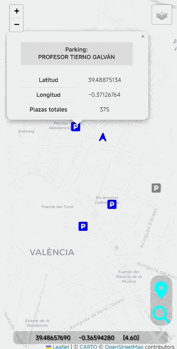

# 🅿️ GeoParkings

**GeoParkings** es una aplicación móvil desarrollada con [Apache Cordova](https://cordova.apache.org/) que integra mapas y navegación tipo *"car driving"* para ayudar a los usuarios a encontrar estacionamientos públicos disponibles en Valencia, usando datos en tiempo real del dataset **"parkings"** de la API del Ayuntamiento de Valencia. Muestra la posición del usuario sobre el mapa y lo guía mediante instrucciones de navegación hasta el parking seleccionado, con el objetivo de reducir el tiempo de búsqueda de aparcamiento.


---

---

## 📑 Tabla de contenidos

- [Funcionalidades](#-funcionalidades)
- [Estructura del proyecto](#-estructura-del-proyecto)
- [Datos y plugins](#-datos-y-plugins)
- [Capturas de pantalla](#️-capturas-de-pantalla)
- [Compilación e instalación](#️-compilación-e-instalación)
- [Tecnologías usadas](#-tecnologías-usadas)
- [Notas](#-notas)

---

## 🚀 Funcionalidades

- 📍 Geolocalización en tiempo real del usuario
- 🔎 Búsqueda de estacionamientos cercanos (radio máximo de 1.5 km)
- 🔄 Disponibilidad de plazas actualizada vía API del Ayuntamiento de Valencia
-
- 🧭 Navegación guiada paso a paso, con instrucciones por voz (TTS) y alertas por vibración
- 💻 Interfaz sencilla e intuitiva

> ⚠️ Las funcionalidades de búsqueda de parkings, cálculo de ruta e instrucciones de navegación dependen de servicios externos en tiempo real (API de datos abiertos de Valencia y servidor público de OSRM). Su disponibilidad y precisión pueden variar según la cobertura de red, el estado de dichos servicios y la zona geográfica (la búsqueda de parkings está limitada a la ciudad de Valencia).

---

## 📁 Estructura del proyecto

```
GeoParkings/
│
├── CORDOVA/
│    └── GeoparkingApp/              # Proyecto Cordova (versión móvil)
│        ├── config.xml              # Configuración de la app (id, nombre, icono, splash)
│        ├── package.json            # Dependencias y plugins Cordova
│        └── www/
│            ├── index.html          # Punto de entrada de la aplicación (movil)
│            ├── css/                # Estilos propios de la aplicación
│            ├── js/
│            │   └── app.js          # Lógica principal: geolocalización, parkings y navegación
│            ├── img/                # Iconos e imágenes de la app (logo, splash...)
│            └── webfonts/           # Tipografías de iconos (Font Awesome)
│
├── index.html                       # Punto de entrada de la aplicación (versión web)
├── css/                             # Estilos (versión web)
├── js/                              # Lógica de la app (versión web)
├── misc/                            # Screenshots
├── webfonts/
├── README.md
└── requirements.txt
```

---

## 🧩 Datos y plugins

**Fuente de datos:** API del Ayuntamiento de Valencia (dataset `parkings`), plazas totales/libres y fecha de actualización, vía peticiones HTTP GET en formato JSON.

**Plugins de Cordova:**

| Plugin | Función |
|---|---|
| `cordova-plugin-geolocation` | GPS en tiempo real |
| `cordova-plugin-device-orientation` | Brújula para la navegación |
| `cordova-plugin-dialogs` | Alertas al usuario |
| `cordova-plugin-tts` | Instrucciones por voz |
| `cordova-plugin-vibration` | Alertas por vibración |

**Otras dependencias:** [Leaflet.js](https://leafletjs.com/) (mapas), [OSRM](http://project-osrm.org/) (routing engine) y [Proj4.js](https://github.com/proj4js/proj4js) (gestión de coordenadas).

---

## 🖼️ Capturas de pantalla

### 📍🔍 Geolocalización del usuario y búsqueda de parkings cercanos


### 🧭 Actualización de ruta en tiempo real


### 🗣️ Navegación guiada


---

## ⚙️ Compilación e instalación

### 🛠️ Compilar desde el código fuente

```bash
git clone https://github.com/jrvalza/GeoParkings.git
cd GeoParkings/CORDOVA/GeoparkingApp
npm install
```

> 📋 Consulta el fichero [`requirements.txt`](requirements.txt) para ver el listado completo de requisitos (Node.js, Cordova CLI, Android SDK, JDK, plugins...) necesarios para compilar el proyecto.

```bash
cordova build android
```
---

### ▶️ Instalación

- El `.apk` resultante se genera en `platforms/android/app/build/outputs/apk/`.
- Instalar el fichero .apk en el movil o emular la app con Android Studio.

---

## 🧠 Tecnologías usadas

| Tecnología | Uso |
|---|---|
| 🟨 JavaScript / 🎨 CSS3 / 📄 HTML5 | Lógica e interfaz |
| 📱 Apache Cordova | Empaquetado de la app web como aplicación nativa Android (.apk) |
| 🍃 Leaflet | Renderizado del mapa interactivo |
| 🧭 OSRM API | Cálculo de rutas |
| 🅿️ API Ayuntamiento de Valencia | Datos de parkings en tiempo real |
| 🗺️ OpenStreetMap / PNOA (IGN) | Capas base del mapa (callejero y ortofoto) |

---


## 📌 Notas

- ✅ La versión **móvil (Android, .apk)** es la única probada y completamente funcional del proyecto; es la forma recomendada de usar la aplicación.
- La búsqueda de parkings está limitada actualmente a los datos abiertos de la ciudad de **Valencia**; fuera de esa zona no se mostrarán resultados.
- El cálculo de rutas depende del servidor público de **OSRM**, por lo que requiere conexión a internet y puede verse afectado por la disponibilidad de dicho servicio.
- La API de parkings de Valencia puede limitar el número de peticiones; la app realiza consultas periódicas controladas para evitar bloqueos.
- Las instrucciones de navegación por voz (TTS) y la vibración solo están disponibles en el entorno móvil (no aplican si se ejecuta como página web en escritorio).
- El proyecto fue desarrollado en el contexto de un Máster en Ingeniería Geomática y Geoinformación.
